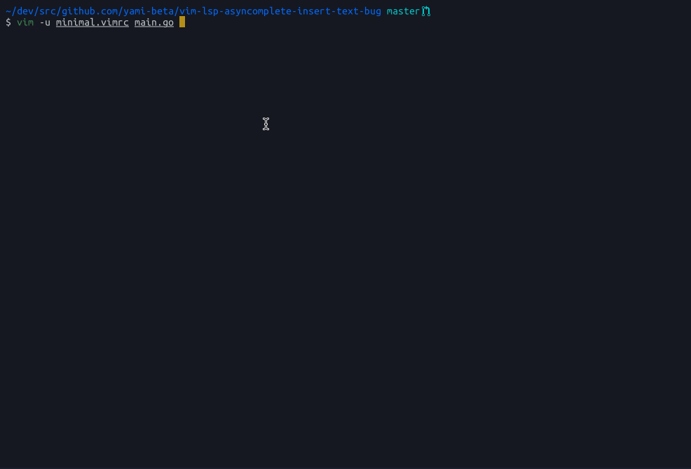
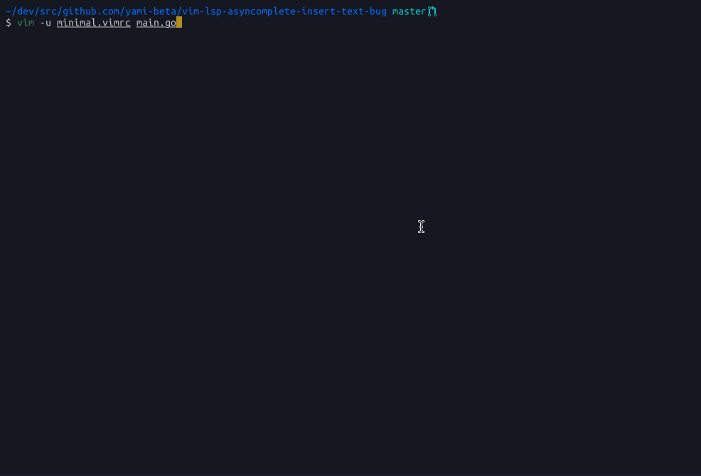

# vim-lsp-asyncomplete-insert-text-bug

```sh
$ export GOBIN=$PWD/bin
$ export PATH=$GOBIN:$PATH
$ go install golang.org/x/tools/cmd/gopls # Install language server
$ vim -u minimal.vimrc # :PlugInstall
$ vim -u minimal.vimrc main.go
```

## Current



## Changed (Expected)



This example is when applying the following patch to vim-lsp.

```diff
diff --git a/autoload/lsp/omni.vim b/autoload/lsp/omni.vim
index ae4e87f..cce5d83 100644
--- a/autoload/lsp/omni.vim
+++ b/autoload/lsp/omni.vim
@@ -154,17 +154,8 @@ function! s:get_completion_result(data) abort
 endfunction

 function! lsp#omni#get_vim_completion_item(item) abort
-    if has_key(a:item, 'insertText') && !empty(a:item['insertText'])
-        if has_key(a:item, 'insertTextFormat') && a:item['insertTextFormat'] != 1
-            let l:word = a:item['label']
-        else
-            let l:word = a:item['insertText']
-        endif
-        let l:abbr = a:item['label']
-    else
-        let l:word = a:item['label']
-        let l:abbr = a:item['label']
-    endif
+    let l:word = a:item['label']
+    let l:abbr = a:item['label']
     let l:menu = lsp#omni#get_kind_text(a:item)
     let l:completion = { 'word': l:word, 'abbr': l:abbr, 'menu': l:menu, 'info': '', 'icase': 1, 'dup': 1 }
```
